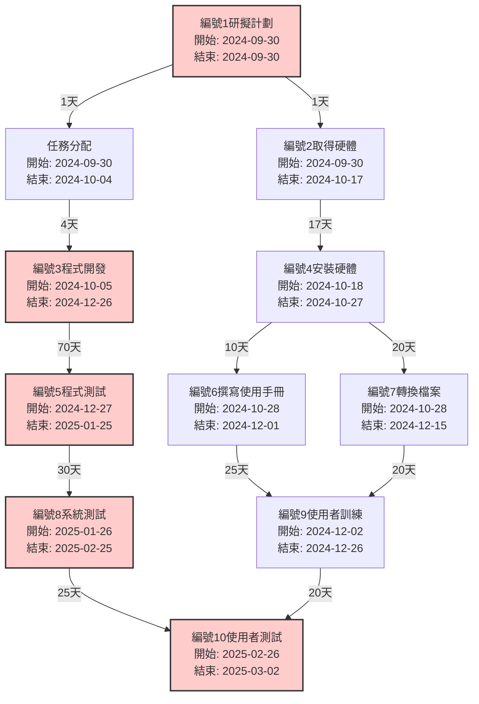

```mermaid
graph TD;
    A[編號1研擬計劃<br/>開始: 2024-09-30<br/>結束: 2024-09-30] -->|1天| B[任務分配<br/>開始: 2024-09-30<br/>結束: 2024-10-04];
    A -->|1天| C[編號2取得硬體<br/>開始: 2024-09-30<br/>結束: 2024-10-17];
    B -->|4天| D[編號3程式開發<br/>開始: 2024-10-05<br/>結束: 2024-12-26];
    C -->|17天| E[編號4安裝硬體<br/>開始: 2024-10-18<br/>結束: 2024-10-27];
    D -->|70天| F[編號5程式測試<br/>開始: 2024-12-27<br/>結束: 2025-01-25];
    E -->|10天| G[編號6撰寫使用手冊<br/>開始: 2024-10-28<br/>結束: 2024-12-01];
    E -->|20天| H[編號7轉換檔案<br/>開始: 2024-10-28<br/>結束: 2024-12-15];
    F -->|30天| I[編號8系統測試<br/>開始: 2025-01-26<br/>結束: 2025-02-25];
    G -->|25天| J[編號9使用者訓練<br/>開始: 2024-12-02<br/>結束: 2024-12-26];
    H -->|20天| J;
    I -->|25天| K[編號10使用者測試<br/>開始: 2025-02-26<br/>結束: 2025-03-02];
    J -->|20天| K;

    style A fill:#ffcccc,stroke:#333,stroke-width:2px;
    style D fill:#ffcccc,stroke:#333,stroke-width:2px;
    style F fill:#ffcccc,stroke:#333,stroke-width:2px;
    style I fill:#ffcccc,stroke:#333,stroke-width:2px;
    style K fill:#ffcccc,stroke:#333,stroke-width:2px;
```

關鍵路徑 編號1>編號2>編號3>編號5>編號6

